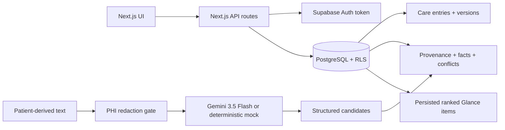

# Nightingale CareNote

Nightingale CareNote is a synthetic longitudinal care-note workspace for the Nightingale 72 Hour Build. It brings clinician notes, staff notes, patient-submitted information, AI-scribed summaries, comments, tasks, provenance, conflicts, and patient-approved content into one consult view.

Core principle: **AI proposes. Humans verify. Provenance proves.**

Product promise: **Know what matters. Know why. Know where it came from.**

All repository data is synthetic. Do not add real patient data or real PHI.

## Demo Scenarios and Roles

Open `/login` and use the synthetic demo-role navigation:

- `patient.jane@example.test` / Jane Tan patient-safe view
- `staff.a@example.test` / Clinic A staff workflow
- `clinician.a@example.test` / Clinic A clinician review and approval
- `admin.a@example.test` / Clinic A scoped oversight
- `staff.b@example.test` / Clinic B isolation test user

Jane Tan is the golden demo patient in Clinic A:

- Apr 15 2025: clinician-documented penicillin allergy
- Feb 6 2026: AI nurse summary says no known drug allergies
- Aug 2026: persistent nocturnal cough
- Aug 2026: repeat renal panel discussed but not ordered
- medication/dose conflict, approved patient-facing content, HOT/WARM/COLD ranking, adaptive importance, and optional synthetic voice capture

The historical AI Scribe rows above are seeded synthetic fixtures for longitudinal context. To demonstrate live generation, open Jane as the clinician demo actor, expand `+ AI Scribe`, paste a synthetic transcript, and click `Generate AI Summary`. That user-triggered flow calls Gemini when `GEMINI_API_KEY` is configured, persists a new unverified internal AI entry, and links it to the original synthetic transcript source.

Care Glance defaults to the top 3 presentable active items and can expand to at most 5. Jane currently has 5 presentable active items after golden-demo artifact filtering. Runtime AI Scribe cards display the full generated summary, with key points and provider metadata under `AI details`.

Visible care-team timeline filters are `All`, `AI Scribe`, `Clinician`, `Staff`, and `Patient`. The underlying `system` author role and backend filter support remain implemented for AI-scribed/system-generated records.

Role switching is demo navigation only. Security is enforced server-side and by PostgreSQL Row Level Security.

## Architecture

Next.js App Router renders the care workspace and API routes. Supabase Auth identifies actors. PostgreSQL stores the longitudinal record and enforces RLS. Python pytest covers real Supabase/RLS integration boundaries, revision history, provenance, redaction, conflicts, patient approval, self-learning, and voice safety.



Warm consult reads use precomputed `glance_items` through `read_patient_glance`; no LLM call or extraction runs on that path. Write/ingestion paths create entries, provenance spans, facts, conflicts, patient-facing drafts, feedback, and ranked Glance rows.

## Setup

```powershell
npm.cmd install
copy .env.example .env.local
npm.cmd run supabase:bootstrap-auth
npm.cmd run supabase:apply
npm.cmd run supabase:verify
npm.cmd run dev
```

Open `http://localhost:3000/login`.

Required environment variables:

- `NEXT_PUBLIC_SUPABASE_URL`
- `NEXT_PUBLIC_SUPABASE_ANON_KEY`
- `SUPABASE_SERVICE_ROLE_KEY`
- `SUPABASE_DB_URL` using the Supabase Session Pooler connection string
- `GEMINI_API_KEY` to enable real Gemini generation on server-side AI-scribe flows
- `GEMINI_MODEL`, default `gemini-3.5-flash`

Optional environment variables:

- `LLM_PROVIDER_ENDPOINT` / `LLM_PROVIDER_API_KEY` for the legacy generic HTTP LLM provider fallback, used only when `GEMINI_API_KEY` is absent and both values are set

Demo actor tokens such as `demo-clinician` and `demo-patient` are built-in synthetic navigation values, not environment variables.

## Validation Commands

```powershell
npm.cmd run supabase:apply
npm.cmd run supabase:verify
npm.cmd run lint
npm.cmd run typecheck
npm.cmd test
pytest
npm.cmd run build
npm.cmd run evaluate:fixtures
npm.cmd run benchmark:glance
npm.cmd run verify:gemini
```

## Security Model

RBAC roles are `patient`, `staff`, `clinician`, and `admin`. Staff, clinicians, and admins are clinic-scoped. Patients can only see explicitly patient-safe approved content and intended patient-submitted information.

PostgreSQL RLS protects base tables. Patients cannot retrieve raw AI-scribed notes, staff/clinician internal notes, internal comments, or unapproved AI-generated guidance. Clinic A users cannot access Clinic B data. Server routes also validate actor roles; UI filtering is not treated as the security boundary. Runtime API errors return stable safe codes/messages rather than raw provider/database text.

The optimized `read_patient_glance` RPC is `SECURITY DEFINER` with fixed `search_path = public`, explicit patient lookup, and an explicit `user_has_clinic_role` check before returning Clinic-scoped rows.

TLS and encryption at rest are deployment assumptions of the configured Supabase/PostgreSQL hosting environment. This repository verifies application RBAC/RLS behavior, but it does not independently audit Supabase infrastructure encryption controls.

## Collaboration, Revisions, and Concurrency

Staff create staff notes; clinicians create clinician notes. Each edit creates an immutable `entry_versions` snapshot and increments `current_version`. Reverting creates a new version containing the older content; intermediate versions remain. Audit events store actor/action/resource/version metadata, not raw clinical note text.

Clinical edits use optimistic concurrency. Writes include `expected_version`; stale same-entry edits fail with HTTP 409 rather than silently using last-write-wins.

## Trust Model

AI-scribed entries are `author_role = system` and remain visually distinct from human notes. Runtime AI Scribe entries start as unverified internal content and retain provider/model metadata plus provenance to the original synthetic transcript/session. The server authorizes the care-team actor before provider invocation, then sends only redacted text through the safe gateway. Structured extraction is preferred over generation for clinical facts. Candidates require exact evidence text, character offsets, source entry/version or transcript source, and provenance resolution before becoming trusted.

Provenance spans resolve to source entry, version, evidence offsets, evidence text, and transcript timestamps where applicable. If offsets are invalid, evidence text does not match, source is missing, or evidence is ambiguous, the system abstains and marks the item `needs_review`.

Risk is clinical severity; importance is what should be seen first now. Deterministic risk floors include allergy conflict, medication conflict, medication-dose conflict, and unresolved critical task as HIGH. A model suggestion may raise risk but cannot lower these floors.

Evidence confidence is evidence quality, not calibrated clinical probability:

- Strong evidence: clinician-authored/confirmed or high-quality deterministic evidence
- Supported: exact provenance with no contradiction
- Needs review: ambiguous, contradictory, unresolved, or low-confidence evidence

Patient-facing AI content starts as draft or needs clinician approval. Only explicitly approved content is visible to patients; unresolved provenance or insufficient trust blocks approval. Editing previously approved patient-facing content resets it to needs clinician approval until reapproved.

Patient-facing summaries can be created manually or generated as editable AI-assisted drafts from selected longitudinal care-record entries. Generated drafts preserve source provenance and remain hidden from the patient until explicitly approved by the care team.

## Importance, Learning, and Decay

Explainable importance ranking persists score components: risk contribution, unresolved action, recency, clinician confirmation, entity priority, decay, and bounded adaptive feedback. Tie-breaking is deterministic.

Adaptive learning is clinic-scoped and bounded. It tracks exposure, manual highlight, pin, clinician confirmation, comments/interactions, and rejection. Exposure is not rejection. Learning changes importance only; it never changes facts, provenance, evidence quality, deterministic risk, or clinician confirmation. This is safety-bounded ranking adaptation, not proof that exposure bias is solved.

Data decay classifies Glance items as:

- `HOT`: recent, unresolved, safety-critical, active, or immediately actionable
- `WARM`: older but longitudinally relevant
- `COLD`: old ordinary resolved context retained for history/provenance

Decay affects ranking/read behavior only. Source history, versions, provenance, facts, conflicts, and audit logs are retained.

## PHI Redaction and AI Providers

Every LLM call goes through the centralized safe AI gateway:

`raw input -> redaction -> verification -> provider`

The current redactor detects synthetic names, Singapore NRIC/FIN-like identifiers, phone numbers, email addresses, and obvious structured identifiers. Metadata reports classes/counts without exposing original values. If verification cannot establish a safe payload, the request is blocked and marked for review.

The provider abstraction supports a real Google Gemini adapter and deterministic/mock providers. If `GEMINI_API_KEY` is configured, server-side AI-scribe and synthetic voice-capture flows use Gemini with `GEMINI_MODEL` defaulting to the documented `gemini-3.5-flash` model. If no Gemini key is configured, the deterministic mock provider remains the default/fallback for tests, offline development, and demos without paid credentials.

The Gemini provider receives redacted text only through `invokeSafeLlm()`. It asks for concise structured JSON for downstream validation, but deterministic extraction, provenance validation, clinical conflict detection, risk floors, importance ranking, and patient-facing approval remain separate from LLM generation. Malformed, empty, timed-out, unavailable, or provider-error responses fail into `needs_review` rather than becoming trusted clinical content.

`npm.cmd run verify:gemini` performs a synthetic smoke test when `GEMINI_API_KEY` is present. It uses synthetic PHI, reports only redaction metadata and provider identity, and does not print the original synthetic values or API key.

## Ambient Voice

Synthetic ambient capture demonstrates architecture only: synthetic audio/transcript upload, deterministic transcription abstraction, speaker-labelled segments, timestamps, uncertainty markers, redaction before AI processing, AI-scribed entry creation, and timestamp provenance. It does not claim production diarization, noisy-room, multilingual, or code-switching accuracy.

## Performance

Benchmark command:

```powershell
npm.cmd run benchmark:glance
```

Latest measured warm Supabase/PostgREST path in `docs/performance/glance-benchmark.json`; representative value uses the median P95 across five consecutive runs:

- warm-up requests: 10
- measured requests: 50
- concurrency: 1
- network included: yes
- median P95 across 5 runs: 193.11 ms
- individual-run P95 range: 173.04–210.86 ms
- last run: P50 149.37 ms, P95 196.78 ms, P99 402.57 ms
- failures: 0
- target: P95 <= 300 ms
- result: target met

The benchmark measures the persisted `read_patient_glance` warm path and records that no LLM call or extraction is performed.

## Evaluation Fixtures

Synthetic evaluation fixtures live in `eval/` and are run with:

```powershell
npm.cmd run evaluate:fixtures
```

Current report:

- redaction: 5 cases, 7 expected detections, 0 missed detections, 1 measurable false positive, recall 1.00 on the fixture set
- extraction: 6 cases, 9 expected candidates, 7 matched, 7 trusted candidates with resolvable provenance, 2/2 abstention cases matched
- conflicts: 6/6 deterministic expected behaviors matched

These are prototype evaluation evidence on small synthetic fixtures, not clinical validation or production-grade redaction/extraction accuracy.

## Known Limitations

- This is a prototype, not a certified clinical system.
- Synthetic fixtures are intentionally small and cannot establish real-world accuracy.
- Physical archival/compression is deferred; HOT/WARM/COLD currently affects classification and ranking only.
- Collaboration uses section/entry optimistic concurrency rather than CRDTs.
- Revision history stores full snapshots rather than complex semantic diff objects.
- AI and transcription providers are abstracted; Gemini can be enabled with a server-only key, and deterministic mock providers keep tests/offline demos working without paid credentials.
- Ambient voice capture is synthetic and not validated for real clinical audio.
- Phone-only patient identity, WhatsApp/SMS/email delivery, and realtime streaming consult alerts are not implemented in this repository.
