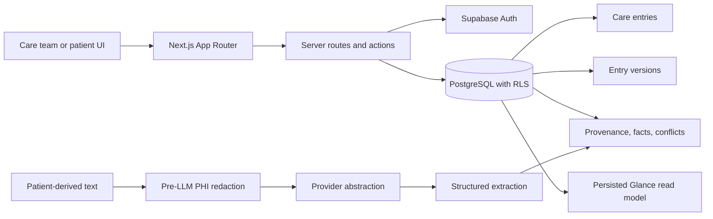
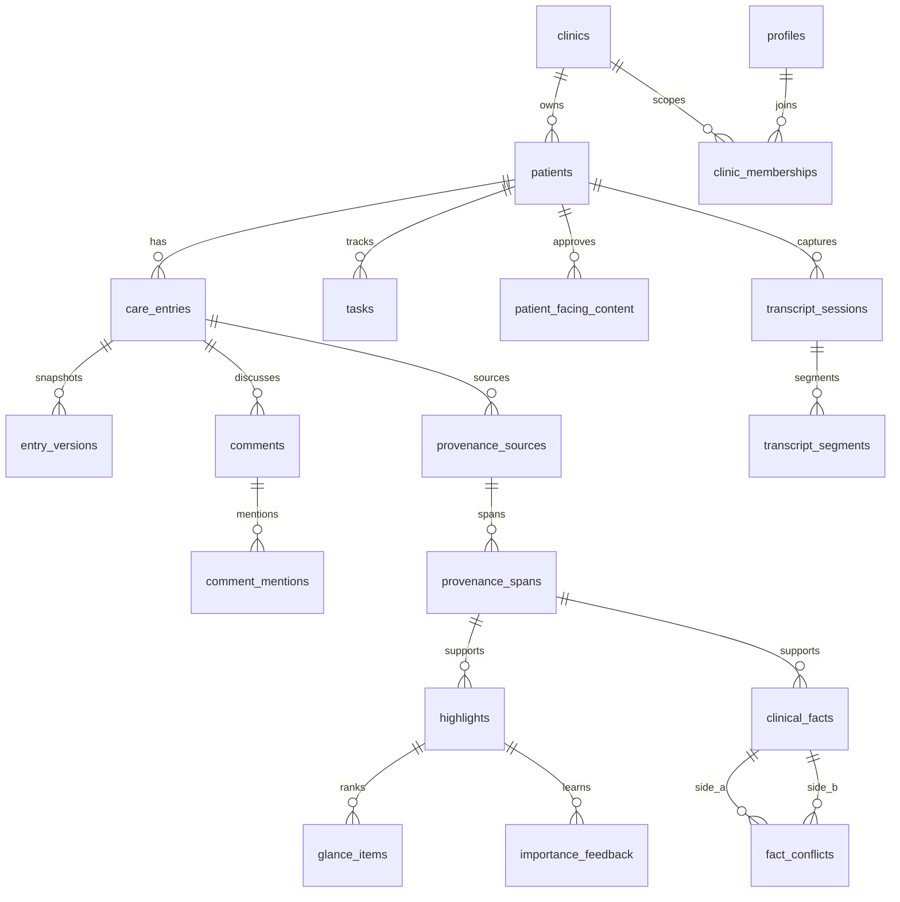

# Nightingale CareNote Technical Brief Source

## 1. Problem and Architecture

Nightingale CareNote addresses a common consult problem: the important context is scattered across old notes, AI-scribed summaries, staff follow-up, patient-submitted context, tasks, and comments. The prototype makes the care team see the most actionable items quickly while preserving the source-of-truth longitudinal record.

Design principle: **AI proposes. Humans verify. Provenance proves.**

Warm read path: `/api/patients/[id]/glance` calls the persisted `read_patient_glance` RPC. It returns only precomputed Glance fields, uses existing Supabase Auth/RLS scope, and performs no LLM call or extraction.

Write/AI path: notes, comments, tasks, patient-facing drafts, AI-scribed entries, transcript capture, facts, conflicts, and feedback write durable rows. Runtime AI Scribe first authorizes the care-team actor, then redacts patient-derived text before the server-side Gemini 3.5 Flash provider call. Generated summaries remain unverified; provenance links the AI entry back to the original synthetic transcript/source span. Provenance spans and score components are computed before the warm consult read.

Care Glance defaults to the top 3 presentable active items and can expand to a hard cap of 5; Jane currently has 5 presentable active items after golden-demo artifact filtering. Runtime AI Scribe cards show the full generated summary, while key points and provider metadata stay under AI details. Visible care-team timeline filters are All, AI Scribe, Clinician, Staff, and Patient; the underlying system author role remains supported for persisted AI/system entries.

Key scope choices: the prototype favors a small, auditable monolith; SQL constraints and RLS over application-only trust; structured extraction over free-form generation; and deterministic clinical rules over model-generated severity.

## 2. Data and Trust

The trust flow is:

AI suggestion -> evidence-linked candidate -> deterministic rules -> human review -> clinician-confirmed/trusted care state.

Entries store source timeline content. Versions preserve immutable snapshots. Comments and tasks support collaboration. Provenance sources/spans point to exact evidence offsets or transcript timestamps. Highlights and Glance items are the visible trust surface. Clinical facts and conflicts keep structured interpretations traceable without overwriting either side. Patient-facing content has an explicit approval state.

Risk, importance, and evidence confidence are separate:

- Risk: clinical/safety severity with deterministic floors such as allergy conflict >= HIGH.
- Importance: what should appear first now, using risk contribution, unresolved action, recency, confirmation, entity priority, decay, and bounded adaptive feedback.
- Evidence confidence: evidence quality semantics, not calibrated clinical probabilities.

Unsupported or ambiguous evidence abstains into `needs_review`; it is not promoted as trusted clinical fact or patient-facing truth.

## 3. Safety, Evaluation, and Tradeoffs

RBAC and PostgreSQL RLS enforce patient isolation, clinic isolation, role ownership, internal comment hiding, raw AI note hiding, and patient approval gates. The optimized `read_patient_glance` RPC is `SECURITY DEFINER` but fixes `search_path = public` and performs explicit clinic-role authorization before returning rows. TLS and encryption at rest are documented as Supabase/PostgreSQL hosting assumptions; the repository verifies application behavior but does not independently audit provider infrastructure encryption controls.

PHI safety uses a centralized pre-LLM redaction gate:

raw input -> redact -> verify -> provider.

The gateway detects synthetic names, Singapore NRIC/FIN-like IDs, phone numbers, emails, and structured identifiers. It records metadata without original PHI and blocks high-risk calls when verification cannot establish a safe provider payload.

Deterministic trust logic remains separate from Gemini output: provenance validation, conflicts, risk floors, evidence-quality semantics, importance ranking, and patient approval are not delegated to the model. Raw AI Scribe entries are internal care-team content; patients can see only explicitly approved patient-facing content.

Performance evidence: `npm.cmd run benchmark:glance` measures the warm Supabase/PostgREST read model with 10 warm-up requests and 50 measured requests at concurrency 1. Five consecutive runs produced a median P95 of 193.11 ms with individual-run P95 range 173.04–210.86 ms, failures 0, network included, target met. The last run measured P50 149.37 ms, P95 196.78 ms, P99 402.57 ms. The warm Glance read performs no LLM call.

Evaluation fixtures are synthetic and intentionally limited. Current fixture report: redaction recall 1.00 on 5 cases with 1 measurable false positive; extraction matched 7/9 expected candidates with 7 trusted provenance-resolvable candidates; abstention matched 2/2 expected cases; conflict behavior matched 6/6 deterministic cases. These results are prototype evidence, not clinical validation.

Tradeoffs:

- Section/entry optimistic concurrency instead of CRDTs.
- Full revision snapshots instead of complex diff storage.
- Deterministic risk floors instead of LLM severity.
- Structured extraction instead of unconstrained clinical generation.
- Bounded adaptive ranking instead of online model training.
- Classification/ranking decay without destructive archival.
- Mock/provider abstraction for external AI and transcription services.
- Synthetic ambient voice capture demonstrates privacy architecture, not production diarization accuracy.

Known assumptions: all demo data is synthetic; external AI/transcription credentials are optional; HOT/WARM/COLD is read/ranking behavior rather than physical archival; clinical evaluation remains out of scope for the prototype.
